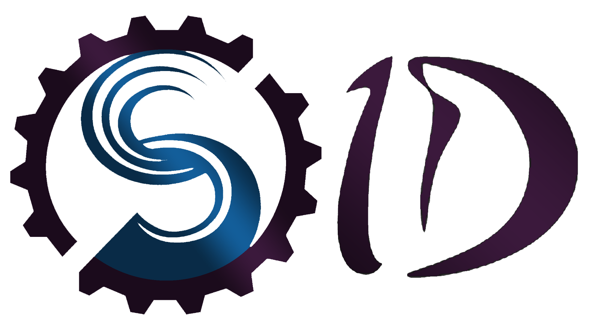

<h1 align="center">SID WEBSITE</h1>

<h2 align="center">DESCRIPCIÓN</h2>

# Documentación página web

El proyecto contará con un header que llevará el logo del SID (), en su menú de navegación los 6 apartados principales y un apartado para el cambio de idioma (Inglés/Español) [no estática, oculta (símbolo de menú)]:

- Home
- About
- Projects
- Team
- News
- Contact

## 1. Home

**Inspiración:**

- [PAG1](https://www.helloheco.com/)
- [PAG2](https://www.snapsound.com/)
- [PAG3](https://ui.dev/)

**Conceptos:**

- Secciones que muestran un poco de información de los otros apartados con botones para acceder a más detalles.
- Diseño lineal.
- Parte inicial inspirada en PAG2 para acceder al apartado *About*, con una frase y botón "quienes somos" o similar.
- Sección con logos de empresas, entidades o grupos aliados.
- Inspiración de PAG1 para mostrar proyectos, donde habrá 4 casillas como abrebocas de cada sección y un botón para acceder al apartado general.
- Muestra del equipo con una foto grupal (foto por tomar), una frase y botón de acceso al apartado *Team*.
- Diseño de casillas para el apartado *News* similar a la última parte de PAG3, con un video de YouTube, publicaciones de Instagram/Facebook y un listado de noticias del SID.

## 2. About

**Inspiración:**

- [PAG1](https://glud.org/)
- [PAG2](https://www.snapsound.com/about)

**Conceptos:**

- Identidad del grupo, misión, visión inspiradas en PAG1.
- Diseño lineal de PAG2, con secciones de alcance, clientes y aliados, incluyendo una pregunta clave sobre cómo ser parte de estos.
- Enlaces a los apartados *Team* y *Contact*.

## 3. Projects

**Inspiración:**

- [PAG1](https://ui.dev/modern-javascript)
- [PAG2](https://dribbble.com/)

**Conceptos:**

El apartado de *Projects* incluirá 4 secciones:

1. Desarrollo web.
2. Desarrollo robótico o IoT.
3. Desarrollo de trabajo social.
4. Desarrollo UD.

Cada sección mostrará información clave y permitirá acceder a más detalles del proyecto. Los proyectos incluirán:

- Información básica, alcance, video explicativo y un apartado para actualizaciones del proyecto.
- Carrusel automático con el equipo del proyecto, con tarjetas que muestren el nombre y, al hacer clic, la información completa de la persona.
- Al final, un botón para acceder al apartado *Team*.

## 4. Team

**Inspiración:**

- [PAG1](https://pi.udistrital.edu.co/COMPLEXUD/Equipo-Trabajo)
- [PAG2](https://dribbble.com/)

**Conceptos:**

Tarjetas de roles jerárquicos con los siguientes atributos:

- Foto.
- Nombre.
- Cargo general.
- Proyectos en los que participa.
- LinkedIn.
- CV (opcional).

Cada tarjeta diferenciará el cargo general, y se podrá acceder a los proyectos de esa persona. También habrá un enlace al apartado *Contact* para ser miembro del equipo.

## 5. News

**Inspiración:**

- [PAG1](https://www.yale.edu/admissions)
- [PAG2](https://dribbble.com/)
- [PAG3](https://www.unisabana.edu.co/portaldenoticias/inicio/)

**Conceptos:**

Se mostrará un video de una noticia reciente del SID al inicio, con un diseño de despliegue de información que combina elementos de PAG1 y PAG3. Cada noticia estará relacionada con proyectos y otras actividades del SID.

## 6. Contact

**Inspiración:**

- [PAG1](https://www.snapsound.com/contact)

**Conceptos:**

El diseño seguirá el estilo de PAG1, con métodos de contacto e información sobre cómo ser aliado del SID (empresas) o cómo formar parte del SID como estudiante (equipo).

## Adicionales

**Animación a objetos:**

Inspiración:

- [Snapsound](https://www.snapsound.com/contact)
- [Dribbble](https://dribbble.com/)
- [Hello Heco](https://www.helloheco.com/)
- [UI.dev](https://ui.dev/)
- [SpaceX Dragon](https://www.spacex.com/vehicles/dragon/)

La página incluirá un footer con derechos de autor, fechas de creación y créditos.
